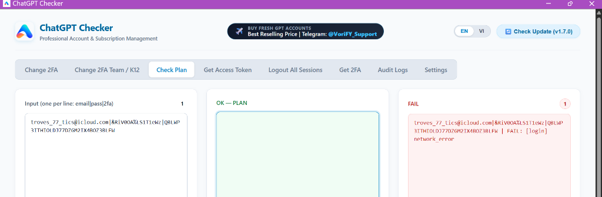

# ChatGPT Checker — Otid Edition 🚀
### Professional Account & Subscription Management for ChatGPT

A high-performance, standalone Windows desktop application designed for bulk managing, plan checking, 2FA rotation, and session management for ChatGPT personal, team, and enterprise accounts.

---

## 🌟 Key Features

| Tool | Description |
| :--- | :--- |
| **🔍 Check Plan** | Reads subscription plans (**Free, Plus, Pro, Go, Team, Business, Enterprise, Edu, K12**), quota usage percentages, reset times, and workspace entitlements across personal and organization workspaces. |
| **🚪 Logout All Sessions** | Terminate all active browser sessions, mobile app tokens, and API credentials across all devices in a single click. |
| **🔐 Change 2FA (Personal)** | Automatically rotate TOTP 2FA secret keys for personal ChatGPT accounts while retaining existing passwords. |
| **🏢 Change 2FA (Team / K12)** | Account-wide 2FA rotation for Team, Business, Enterprise, Edu, and K12 multi-workspace accounts. |
| **🔑 Get Access Token** | Retrieve fresh ChatGPT OAuth Bearer access tokens (`chatgpt.com/api/auth/session`) for downstream automation. |
| **⏱️ Get 2FA (TOTP Generator)** | Bulk generate real-time 6-digit 2FA OTP codes from credentials (`email\|pass\|secret`) or standalone Base32 secret keys. |
| **🛡️ Proxy & Stealth Support** | Full HTTP / SOCKS5 proxy rotation support with TLS fingerprint impersonation to bypass Cloudflare and rate limits. |
| **📊 30-Day Audit Logs** | Comprehensive daily audit trail with real-time streaming, filtering, and 1-click TXT exports. |

---

## 📥 Quick Start & Installation

### 1. Download Setup
Download the latest installer from the **[Releases](https://github.com/bussmail73-cmd/ChatGPTChecker/releases/latest)** page:
* **`Setup.exe`** (Single installer, portable & complete)

### 2. Zero Technical Requirements
* **No Node.js installation needed!**
* **No Python installation needed!**
* All runtimes, libraries, and dependencies are 100% pre-bundled inside the installer.

### 3. Run & Enjoy
1. Double-click `Setup.exe`.
2. Follow the 5-second setup wizard (creates a Desktop shortcut).
3. Open **ChatGPT Checker** from your desktop and start managing accounts!

---

## 🔄 Live Automatic In-App Updates

ChatGPT Checker comes with built-in **1-Click Live Updating**:
* When a new update is released, a notification badge appears in the top-right corner: `🔔 New update available!`.
* Click **Update Now**, and the application automatically downloads the patch, verifies its checksum, and updates itself in 5 seconds.
* Your credentials, logs, and settings remain 100% safe and intact.

---

## 📞 Buy ChatGPT Accounts & Official Support

Looking to buy fresh bulk ChatGPT accounts at the best reselling rates, or need assistance?

* **Brand / Support:** **Otid**
* **Telegram:** [@VoriFY_Support](https://t.me/VoriFY_Support)
* **WhatsApp:** [+92 322 8784060](https://wa.me/923228784060)

---

*ChatGPT Checker — Fast, Secure, and Automated.*
